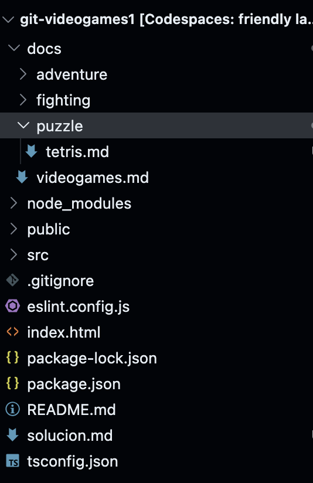
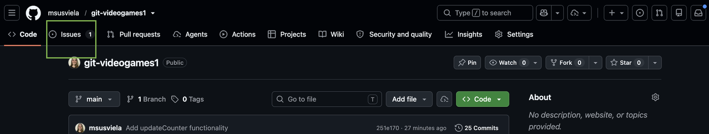
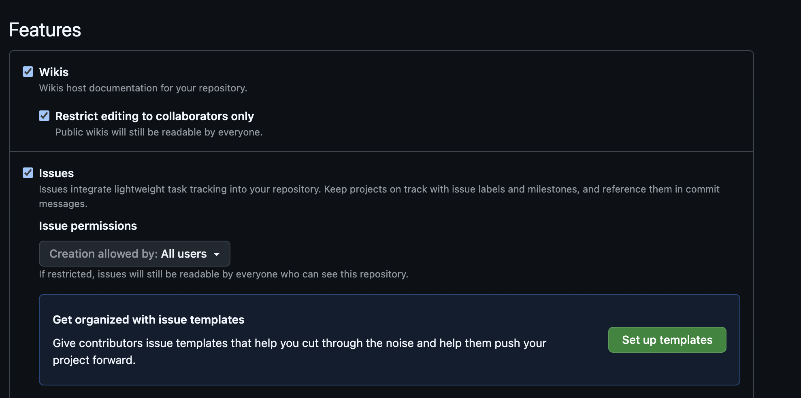

# Solución

Esta solución es una guía. Pueden haber múltiples soluciones válidas (y distintas a las propuestas aquí) para cada una de las partes.

## Parte A:

En esta parte trabajaremos únicamente con documentación (Con archivos de la carpeta docs). Utilizaremos el formato [Markdown](https://docs.github.com/es/get-started/writing-on-github/getting-started-with-writing-and-formatting-on-github/basic-writing-and-formatting-syntax). 

### Ficha de videojuego

> 1. Crear el directorio docs/puzzle/. Puedes usar el comando mkdir docs/puzzle

- Para esta parte, se puede crear sobre el explorador de VSCode, o alternativamente desde la terminal (En este ejemplo usaremos Bash) con los siguientes comandos:

```bash
mkdir docs/puzzle/
```

Es importante verificar que siempre posicionados sobre el root del proyecto, es decir, la carpeta git-videogames del repositorio clonado, para ejecutar correctamente los comandos propuestos por la solución.

> 2. Crear el archivo docs/puzzle/tetris.md y agregar una tabla con la información del juego Tetris, similar a los cuadros de Street Fighter II y Zelda Ocarina. El año de publicación del juego fue 1984 y el desarrollador Alexey Pajitnov.

- Al igual que la parte anterior, se puede utilizar el explorador o terminal. Si se opta por terminal:

``` bash
cd docs/puzzle
touch tetris.md
cd ..
cd ..
```

**Explicación:** Utilizaremos el comando de change directory (`cd`) para movernos a la carpeta donde queremos crear el archivo, en este caso la que creamos en el paso anterior. Con el comando `touch` crearemos el archivo. Importante especificar título y formato (.md). Luego, con el comando `cd ..` lo que haremos es movernos entre carpetas, en este caso, los dos puntos indican que volveremos a la carpeta anterior. Recuerden revisar siempre en terminal sobre qué carpeta están, para realizar correctamente las operaciones, principalmente al trabajar con Git.

Tanto si lo hicieron desde el explorador, como desde terminal, debería quedarles una estructura así:


Respecto al contenido del archivo de tetris.md, recomiendo utilizar la tabla en Markdown de los archivos de [Zelda](./docs/adventure/zelda-ocarina.md) o [Street Fighter](./docs/fighting/street-fighter-ii.md) y modificarla según los datos de la letra.


### Links y listas

Modificar el archivo [videogames.md](./docs/videogames.md) ubicado en la carpeta docs.
Agregar la info que piden en la sección correspondiente. Agregar el link utilizado la sintaxis de markdown para enlaces:

```
[Texto a mostrar](url)
```

De manera similar, agregar el enlace al archivo de tetris creado en el item anterior. Para ello utilizaremos la misma sintaxis que para enlaces, pero en lugar de una url, poner la ruta relativa, para este caso:
```
[Tetris](./puzzle/tetris.md)
```

> Siempre ante la duda, para verificar que el enlace quedó generado correctamente, se puede hacer `ctrl + click` (o `cmd + click` si están en Mac) y corroborar que nos redirecciona correctamente.

Por último:
Para esta parte:
> Hacer commit en main con el mensaje "Add puzzle genre docs" y push de los cambios.

Ejecutar (siempre sobre la carpeta root del proyecto, es decir git-videogames):
```bash
git add .
git commit -m "Add puzzle genre docs" 
git push
```

Una vez realizado, se puede verificar en el repositorio de GitHub que haya quedado correctamente pusheado, viendo el contenido del repositorio o el historial de commits, donde el último debe ser el commit recién realizado.

En este caso, les dejo la url al commit realizado en este punto. Van a poder corroborar el estado de los archivos de tetris.md y videogames.md para esta parte:

[Commit](https://github.com/msusviela/git-videogames1/commit/69a865c500edb7119814a0adf85476e3e6a93251)

## Parte B:

En esta parte, vamos a modificar código, por lo que vamos a trabajar con archivos de la carpeta `src`.

### TODO 1: Filtro por género (src/domain/GamesList.ts)

Ir al archivo GameList ubicado dentro de la carpeta `src/domain`. Observar que es un archivo que persiste una lista de juegos. 
Ubicar el método `filterByGenre` (originalmente en la línea 22). Agregar una lógica de filtrado. Hay varias formas de implementar esto, lo importante es que una vez que se vuelva a levantar la app (con el comando `npm run dev`), que los filtros funcionen correctamente.

Dejo en este commit, una sugerencia de cómo se puede implementar, aunque hay que tener en cuenta que no es la única solución posible:
[Commit](https://github.com/msusviela/git-videogames1/commit/b2dc3d52d13cc57ee9fe3ab23c3aef5e63731d36)

- Comandos utilizados para el commit:
```bash
git commit -a -m "Add filterByGenre functionality" 
git push
```
> Observación: Se utilizó la flag -a para hacer el add automáticamente junto al commit. Esto es análogo a ejectar `git add .`


### TODO 2: Contador de juegos (src/main.ts)

Acá debemos ir al archivo `main.ts`, ubicado en la carpeta src. Este archivo, es el que conecta toda la lógica de negocio (clases de typescript de la carpeta domain, que definen el comportamiento de la aplicación) con la interfaz de usuario (elementos de HTML renderizados en pantalla).

Ubicamos el método `updateCounter`. Observar que tiene ese método.
Por un lado, ver que cómo parámetro se obtiene la variable _counter. Si vamos a donde se llama el método (dentro de `main.ts`), podemos observar el siguiente fragmento de código:

```typescript
function renderFilters(activeGenre: string): void {
  const container = document.querySelector<HTMLDivElement>('#filters')!
  container.innerHTML = getGenres()
    .map((genre) => {
      const active = genre === activeGenre ? 'btn-dark' : 'btn-outline-dark'
      return `<button class="btn btn-sm ${active}" data-genre="${genre}">${genre}</button>`
    })
    .join('')

  container.querySelectorAll<HTMLButtonElement>('button').forEach((btn) => {
    btn.addEventListener('click', () => {
      const genre = btn.dataset.genre ?? 'All'
      const filtered = gamesList.filterByGenre(genre)
      renderCards(filtered)
      renderFilters(genre)
      updateCounter(filtered.length)
    })
  })
}
```

Acá se puede observar que ya se le pasa como parámetro la cantidad de elementos que hay en la lista filtrados. Por la letra del ejercicio, esto es lo que queremos mostrar en la interfaz de usuario, por lo que **no es necesario agregar ninguna lógica para contar esos juegos**. Lo único que resta entonces, es conectar esa información con lo que se muestra en el HTML.

Para ello volvemos al método `updateCounter`. Ahí podemos ver que como variable se obtiene el elemento HTML:

```typescript
  const el = document.querySelector<HTMLSpanElement>('#count')!
```
Como es un elemento de texto, podemos modificar utilizando `el.textContent` el texto a mostrar en la interfaz de usuario, pasándole en este caso el parámetro que acepta el método que ya nos va a traer ese número.

[Commit](https://github.com/msusviela/git-videogames1/commit/251e17035d1db802e1cd1d85aad559a7f5b97bff)

El commit se genera de forma análoga a los pasos anteriores. 

## Finalización

Ejecutar `git push origin main` desde la terminal. Esto enviará todos los cambios al repositorio remoto. Se puede verificar la correctitud del push desde el historial de commits en el repositorio de GitHub.

Sacar una captura de pantalla con el resultado final. Crear un issue. Deberán visualizar el enlace a los issues del repositorio dentro de las opciones que aparece en la parte superior de la página de GitHub:



Si no aparece, se puede ir a la pestaña de Settings (o configuración) dentro del repositorio. Se encuentra también en la parte superior de la página de GitHub del repositorio. Allí en la pestaña de general, buscamos la opción de Features y habilitamos los issues:



Ejemplo de issue: https://github.com/msusviela/git-videogames1/issues/2

> PD: Este archivo fue creado utilizando el formato Markdown, pueden utilizarlo como referencia para ver cómo se agregaron enlaces, imágenes, etc.
